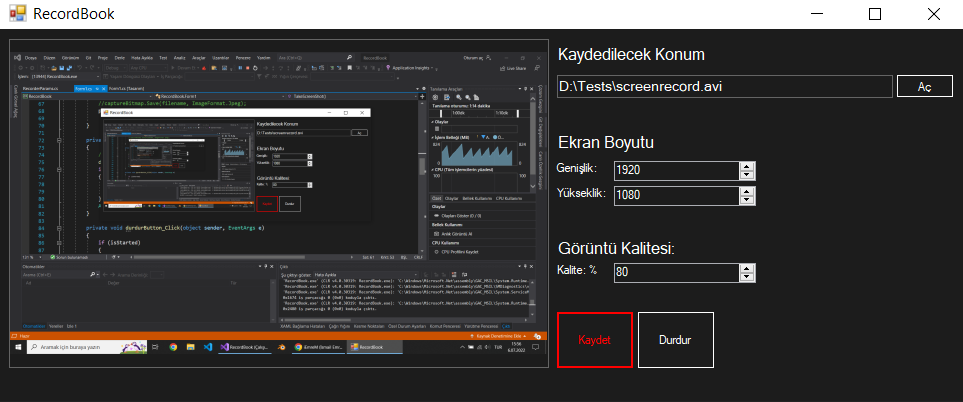

# RecordBook-Screen-Recorder
A simple screen recorder program with C#

RecordBook is a desktop application for screen recording developed with C#, Windows Forms. It is convenient and fast for instant recordings. 
 

## Packages
This program uses version 2.2.1 of SharpAvi package. You may have some issues with the latest version. If you want to use 3.0.0 or newer version you need to change some class names and modify the code.
 

## Running the application
- Clone this GitHub repository
- Install SharpAvi package
- Build the code

**Or you can just download it from releases and start to use it.**
 

## Using the application
Firstly, choose where you want to save the output file.

Then write your screen size. Default size is 1920x1080.

Finally, choose your video quality , *You can use lower quality for lower file size* , and click record button. You can stop recording by clicking stop button or closing the window.
 

## Planning features for short time
- Automatic screen resolution detection
- Selectable recording area
- Changable cursor
- Timer
- Audio recording
- Language support